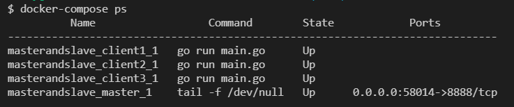
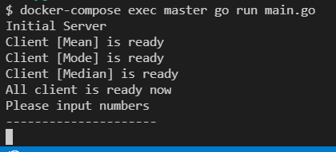
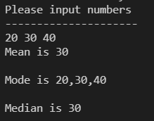
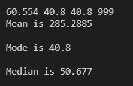
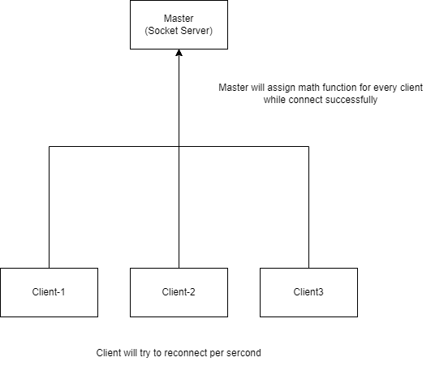
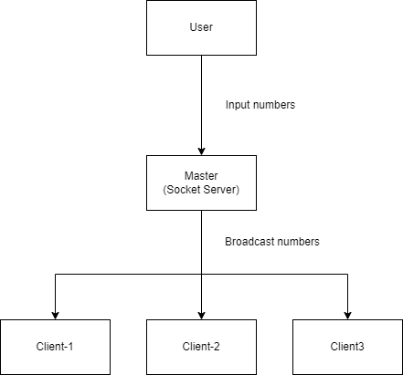
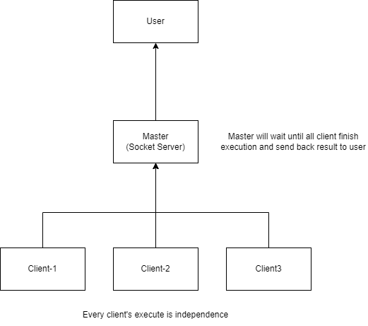

## Description

This is a simple master and slave server with socket, input the numbers, and will output `Mean` `Mode` `Median`

## Table of Contents

- [Description](#description)
- [Table of Contents](#table-of-contents)
- [Preparation](#preparation)
- [Quick Start](#quick-start)
- [Commands](#commands)
- [Architecture](#architecture)

## Preparation

- [docker](https://www.docker.com) - `17.04.0+`
- [docker-compose](https://docs.docker.com/compose) - `1.27.0+`

## Quick Start

- Run docker container
    - Go to project directory
    - Input ```docker-compose up -d```
    - Waiting until finish
    - Check container's status with ```docker-compose ps```
    
    
    - Client will auto connect to `master` 

- Start `master`
    - Input ```docker-compose exec master go run main.go```
    - Wait all client connect to `master`
    - You will see the output as image here
    
    
    - When you get `Please input numbers`, you can start input the numbers

## Commands
- Input numbers, every number is split by one space
    - like `20 30 40`
    
    
    - Also support float number `60.554 40.8 40.8 999`
    
    
- Quit
    - Input `quit`, you can exit this execution

## Architecture

- Launch server and client


- Input number and broadcast


- Return result to user

